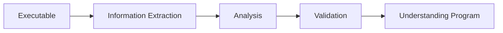

# Week 01 — Introduction to Reverse Engineering

---

# Ringkasan

Pada pertemuan pertama, saya mempelajari konsep dasar **Reverse Engineering (RE)** sebagai fondasi sebelum memasuki materi yang lebih teknis. Materi diawali dengan membahas perbedaan antara *Forward Engineering* dan *Reverse Engineering*, kemudian dilanjutkan dengan tahapan umum dalam proses RE, manfaatnya di bidang keamanan siber, studi kasus penerapan di dunia nyata, serta pengenalan beberapa tools yang umum digunakan. Selain itu, saya juga mulai mengenal **IDA Free**, salah satu *interactive disassembler* yang akan digunakan selama proses pembelajaran.

---

# Pembahasan Materi

## 1. Forward Engineering vs Reverse Engineering

Dalam pengembangan perangkat lunak, proses yang umum dilakukan adalah **Forward Engineering**, yaitu membangun sebuah aplikasi mulai dari perancangan hingga menghasilkan program yang dapat dijalankan.

Alur sederhananya adalah sebagai berikut:

```text
Source Code
     │
     │ Compile
     ▼
Executable / Binary
     │
     │ Load ke Memory
     ▼
Program Berjalan
```

Sebagai contoh, sebuah program yang ditulis menggunakan bahasa C akan dikompilasi menjadi file `.exe` pada Windows. File inilah yang nantinya dijalankan oleh sistem operasi.

Berbeda dengan Forward Engineering, **Reverse Engineering** memulai proses dari file executable yang sudah jadi untuk dipelajari kembali bagaimana cara kerjanya. Tujuannya bukan untuk memperoleh source code asli secara sempurna, tetapi memahami logika, struktur, serta mekanisme kerja program tersebut.

```text
Executable
     │
     │ Disassembly
     ▼
Assembly Code
     │
     │ Decompile
     ▼
Pseudo Code
```

---

## 2. Tahapan Reverse Engineering

Secara umum proses Reverse Engineering terdiri dari tiga tahapan utama.

### Information Extraction

Tahap pertama adalah mengumpulkan informasi dari file binary tanpa mengubah isinya. Informasi yang dicari dapat berupa:

- Strings
- Import Function
- Export Function
- Header file
- Metadata
- Resource
- Struktur executable

Tahap ini bertujuan memperoleh gambaran awal mengenai program yang akan dianalisis.

---

### Modelling / Analysis

Informasi yang diperoleh kemudian dianalisis untuk memahami bagaimana program bekerja.

Beberapa hal yang dipelajari pada tahap ini meliputi:

- Alur eksekusi program
- Fungsi-fungsi penting
- Mekanisme autentikasi
- Algoritma yang digunakan
- Teknik proteksi

Tahap ini merupakan inti dari proses Reverse Engineering.

---

### Review / Validation

Hasil analisis kemudian divalidasi menggunakan berbagai teknik seperti:

- Debugging
- Dynamic Analysis
- Sandbox
- Proof of Concept (PoC)

Validasi dilakukan agar hasil analisis benar-benar sesuai dengan perilaku program ketika dijalankan.

---

## 3. Mengapa Reverse Engineering Penting?

Reverse Engineering memiliki banyak manfaat dalam dunia keamanan siber maupun pengembangan perangkat lunak.

### a. Analisis Malware

Security researcher dapat memahami cara kerja malware sehingga dapat mengembangkan teknik deteksi maupun mitigasi yang lebih efektif.

### b. Vulnerability Assessment

Reverse Engineering membantu menemukan kelemahan keamanan yang mungkin tidak terlihat dari pengujian biasa.

### c. Software Maintenance

Ketika source code tidak tersedia, Reverse Engineering dapat membantu memahami struktur aplikasi sehingga proses pemeliharaan menjadi lebih mudah.

### d. Digital Forensics

Dalam investigasi insiden keamanan, Reverse Engineering digunakan untuk mengetahui bagaimana suatu malware atau aplikasi berbahaya bekerja.

---

## 4. Studi Kasus

### WannaCry Ransomware (2017)

Salah satu contoh terkenal adalah analisis terhadap ransomware **WannaCry**. Dengan Reverse Engineering, peneliti berhasil memahami mekanisme penyebaran malware, teknik enkripsi data, serta menemukan cara untuk memperlambat penyebarannya.

---

### Analisis Firmware IoT

Banyak perangkat IoT menggunakan firmware tertutup (*closed source*). Reverse Engineering memungkinkan peneliti menemukan kelemahan keamanan sehingga produsen dapat memperbaikinya melalui pembaruan firmware.

---

## 5. Tools Reverse Engineering

Beberapa tools yang umum digunakan antara lain:

| Tools | Fungsi |
|--------|--------|
| IDA Free | Interactive Disassembler |
| Ghidra | Disassembler dan Decompiler |
| Binary Ninja | Reverse Engineering Framework |
| OllyDbg | Dynamic Debugger |
| x64dbg | Debugger untuk Windows |
| radare2 | Framework Reverse Engineering |
| HxD | Hex Editor |

Setiap tools memiliki keunggulan masing-masing sehingga penggunaannya bergantung pada kebutuhan analisis.

---

## 6. Mengenal IDA Free

Selama perkuliahan ini, tools utama yang digunakan adalah **IDA Free**.

Beberapa fitur yang tersedia:

- Interactive Disassembler
- Function Analysis
- Graph View
- Local Debugger
- Cloud Decompiler
- Cross Reference Analysis

Kelebihan IDA Free:

- Gratis digunakan
- Mudah dipelajari
- Mendukung berbagai format executable
- Memiliki tampilan visual yang membantu memahami alur program

Keterbatasannya antara lain:

- Fitur decompiler lebih terbatas dibanding versi Pro.
- Dukungan arsitektur prosesor tidak selengkap IDA Pro.
- Tidak mendukung beberapa fitur debugging tingkat lanjut.

---

# Diagram Proses Reverse Engineering



---

# Insight Minggu Ini

Dari materi yang dipelajari, saya menyadari bahwa Reverse Engineering bukan sekadar membongkar aplikasi untuk mengetahui isi program, tetapi merupakan proses analisis yang sistematis. Setiap tahapan memiliki tujuan yang berbeda sehingga hasil analisis dapat dipertanggungjawabkan. Saya juga memahami bahwa kemampuan Reverse Engineering memiliki peran penting dalam keamanan siber, khususnya pada analisis malware, audit keamanan aplikasi, dan digital forensics.

---

# Tools yang Dipelajari

- IDA Free
- Ghidra
- x64dbg
- Binary Ninja
- HxD
- radare2

---

# Referensi

1. Modul Reverse Engineering
2. Dokumentasi IDA Free
3. Dokumentasi Ghidra
4. Malware Unicorn RE Notes

---

# Refleksi Pembelajaran

## Apa yang Saya Pahami

Setelah mempelajari materi pengantar ini, saya memahami bahwa Reverse Engineering merupakan proses untuk menganalisis suatu perangkat lunak tanpa memiliki source code asli. Saya juga memahami perbedaan mendasar antara Forward Engineering dan Reverse Engineering, serta mengetahui tahapan utama yang dilakukan ketika menganalisis sebuah executable. Selain itu, saya mulai mengenal beberapa tools yang akan digunakan selama praktikum, khususnya IDA Free sebagai disassembler utama.

## Apa yang Masih Membingungkan

Saya masih ingin memahami bagaimana sebuah disassembler dapat menerjemahkan machine code menjadi instruksi assembly yang dapat dibaca manusia. Selain itu, saya juga penasaran mengenai proses decompiler dalam menghasilkan pseudo-code yang menyerupai source code asli, karena hasil dekompilasi sering kali berbeda dengan kode yang awalnya ditulis oleh programmer.

## Kesimpulan Pribadi

Pertemuan pertama memberikan gambaran umum mengenai ruang lingkup Reverse Engineering dan pentingnya bidang ini dalam keamanan siber. Materi ini menjadi fondasi yang penting sebelum mempelajari teknik analisis executable secara lebih mendalam pada pertemuan berikutnya. Dengan memahami konsep dasar dan tools yang digunakan, saya memiliki gambaran mengenai proses yang akan dilakukan selama praktikum Reverse Engineering.

---
