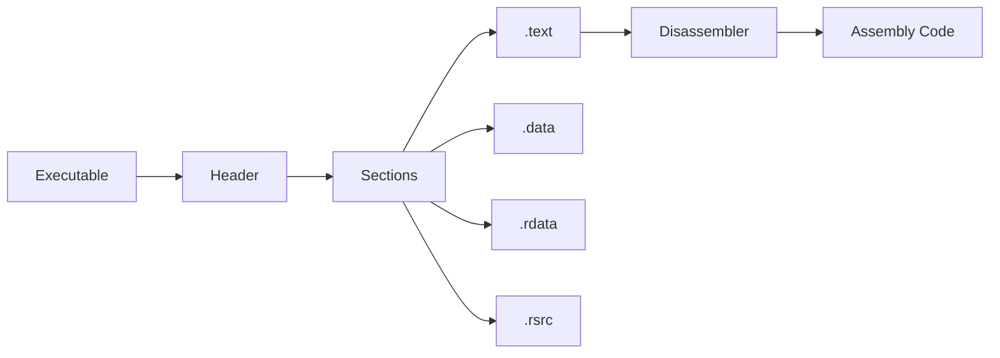

# Week 03 — Binary & Executable

---

# Ringkasan

Pada pertemuan ketiga, saya mempelajari konsep dasar **Binary** dan **Executable** sebagai fondasi utama dalam Reverse Engineering. Saya memahami bagaimana sebuah program yang ditulis menggunakan bahasa tingkat tinggi diproses melalui tahapan preprocessing, compiling, assembling, dan linking hingga menghasilkan file executable yang dapat dijalankan oleh sistem operasi. Selain itu, saya juga mempelajari berbagai format executable yang digunakan pada sistem operasi yang berbeda, struktur internal executable, konsep endianness, serta bagaimana tools Reverse Engineering memanfaatkan informasi tersebut untuk menganalisis suatu program.

---

# Pembahasan Materi

## 1. Apa itu Binary?

Binary merupakan representasi data dalam bentuk angka **0** dan **1** yang dipahami secara langsung oleh prosesor (CPU). Dalam konteks Reverse Engineering, istilah *binary* sering mengacu pada kumpulan **machine code**, yaitu instruksi yang dapat dieksekusi langsung oleh arsitektur prosesor seperti x86, x64, maupun ARM.

Berbeda dengan source code yang mudah dipahami manusia, binary hanya berisi instruksi mesin sehingga memerlukan tools khusus agar dapat dianalisis.

Contoh sederhana proses perubahan source code menjadi binary:

```text
Source Code (C/C++)
        │
        ▼
Compiler
        │
        ▼
Assembly
        │
        ▼
Machine Code (Binary)
```

---

## 2. Apa itu Executable?

Executable adalah file hasil proses kompilasi yang memiliki format tertentu sehingga dapat dikenali dan dijalankan oleh sistem operasi.

Ketika pengguna membuka sebuah file executable, sistem operasi akan:

1. Membaca header file.
2. Memuat program ke dalam memori.
3. Menyiapkan section yang diperlukan.
4. Menjalankan program dari **Entry Point**.

Dengan kata lain, executable merupakan wadah yang berisi machine code beserta informasi lain yang dibutuhkan sistem operasi untuk menjalankan program.

---

## 3. Proses Terbentuknya Executable

Sebelum menjadi executable, source code harus melalui beberapa tahapan.

### a. Preprocessing

Tahap awal yang menangani berbagai direktif seperti:

- `#include`
- `#define`
- Macro
- Conditional Compilation

---

### b. Compiling

Compiler menerjemahkan source code menjadi bahasa Assembly sesuai arsitektur prosesor.

---

### c. Assembling

Assembler mengubah instruksi Assembly menjadi object file (`.o` atau `.obj`) yang berisi machine code.

---

### d. Linking

Object file kemudian digabungkan dengan berbagai library sehingga menghasilkan satu file executable yang utuh.

Diagram prosesnya:

```text
Source Code
     │
Preprocessing
     │
Compiling
     │
Assembly
     │
Assembling
     │
Object File
     │
Linking
     │
Executable
```

---

## 4. Format Executable

Setiap sistem operasi memiliki format executable yang berbeda.

| Format | Sistem Operasi | Magic Header |
|---------|----------------|--------------|
| PE (Portable Executable) | Windows | MZ |
| ELF (Executable and Linkable Format) | Linux | 0x7F ELF |
| Mach-O | macOS / iOS | Mach-O Header |

Format tersebut menentukan bagaimana sistem operasi membaca struktur executable.

Sebagai contoh:

- Windows menggunakan format **PE**.
- Linux menggunakan **ELF**.
- macOS menggunakan **Mach-O**.

---

## 5. Struktur Internal Executable

Executable terdiri atas beberapa bagian penting yang disebut **Section**.

### Header

Berisi informasi dasar mengenai file, seperti:

- Arsitektur CPU
- Entry Point
- Jumlah Section
- Ukuran File
- Metadata

---

### .text

Section yang berisi seluruh instruksi machine code yang akan dieksekusi CPU.

---

### .data

Berisi variabel global maupun variabel statis yang telah diinisialisasi.

---

### .rdata

Berisi data yang bersifat read-only, misalnya string konstan.

---

### .rsrc

Berisi berbagai resource seperti:

- Icon
- Gambar
- Dialog
- Menu

---

Diagram sederhana:

```text
Executable

+----------------+
| Header         |
+----------------+
| .text          |
+----------------+
| .data          |
+----------------+
| .rdata         |
+----------------+
| .rsrc          |
+----------------+
```

---

## 6. Konsep Endianness

Endianness adalah cara prosesor menyimpan data yang memiliki lebih dari satu byte di dalam memori.

### Little Endian

Byte dengan nilai paling kecil disimpan pada alamat memori paling rendah.

Contoh angka:

```
0x12345678
```

Disimpan menjadi:

```
78 56 34 12
```

Little Endian digunakan oleh sebagian besar prosesor modern seperti Intel x86 dan x64.

---

### Big Endian

Byte dengan nilai paling besar disimpan terlebih dahulu.

```
12 34 56 78
```

Konsep ini penting karena memengaruhi cara membaca data saat melakukan analisis binary.

---

## 7. Relevansi Binary terhadap Reverse Engineering

Dalam Reverse Engineering, analis hampir selalu bekerja dengan file executable, bukan source code.

Oleh karena itu, pemahaman mengenai:

- Struktur executable
- Section
- Entry Point
- Header
- Machine Code

merupakan dasar sebelum melakukan proses disassembly maupun debugging.

Tanpa memahami struktur executable, analis akan kesulitan menentukan bagian mana yang perlu dianalisis terlebih dahulu.

---

## 8. Tools yang Digunakan

Beberapa tools yang umum digunakan untuk mempelajari binary antara lain:

| Tools | Fungsi |
|--------|--------|
| IDA Free | Disassembler |
| Ghidra | Disassembler & Decompiler |
| Detect It Easy (DIE) | Mengidentifikasi compiler, packer, dan format executable |
| HxD | Hex Editor |
| PE-bear | Analisis struktur PE |
| PEStudio | Analisis executable Windows |

---

# Diagram Alur Analisis Executable



---

# Insight Minggu Ini

Materi minggu ini membuat saya memahami bahwa executable bukan hanya kumpulan instruksi mesin, tetapi memiliki struktur yang cukup kompleks agar dapat dijalankan oleh sistem operasi. Saya juga menyadari bahwa memahami format executable merupakan langkah awal sebelum melakukan analisis menggunakan tools seperti Ghidra maupun IDA Free. Pengetahuan mengenai section dan header akan sangat membantu ketika mulai menganalisis program yang lebih besar pada pertemuan selanjutnya.

---

# Tools yang Dipelajari

- IDA Free
- Ghidra
- Detect It Easy (DIE)
- HxD
- PEStudio
- PE-bear

---

# Referensi

1. Modul Waskita Amikom Reverse Engineering
2. Microsoft PE Format Documentation
3. Linux ELF Specification
4. Ghidra Documentation

---

# Refleksi Pembelajaran

## Apa yang Saya Pahami

Pada minggu ini saya memahami bahwa file executable merupakan hasil akhir dari proses kompilasi yang memiliki struktur tertentu agar dapat dijalankan oleh sistem operasi. Saya juga memahami tahapan pembentukan executable mulai dari preprocessing hingga linking, serta mengenal berbagai format executable seperti PE, ELF, dan Mach-O. Selain itu, saya mulai memahami fungsi setiap section pada executable dan pentingnya konsep endianness ketika membaca data dalam bentuk binary.

## Apa yang Masih Membingungkan

Saya masih ingin memahami lebih dalam bagaimana sistem operasi menentukan Entry Point ketika menjalankan executable serta bagaimana compiler menyusun section-section di dalam file executable. Selain itu, saya juga ingin mempelajari bagaimana executable yang telah diproteksi menggunakan packer atau obfuscator dapat memengaruhi proses analisis pada tools Reverse Engineering.

## Kesimpulan Pribadi

Materi mengenai Binary dan Executable memberikan dasar yang sangat penting sebelum mempelajari teknik Reverse Engineering yang lebih lanjut. Dengan memahami bagaimana executable dibentuk dan bagaimana struktur internalnya bekerja, saya merasa lebih siap untuk mempelajari proses Static Analysis, Disassembly, maupun Dynamic Analysis pada pertemuan berikutnya.

---
