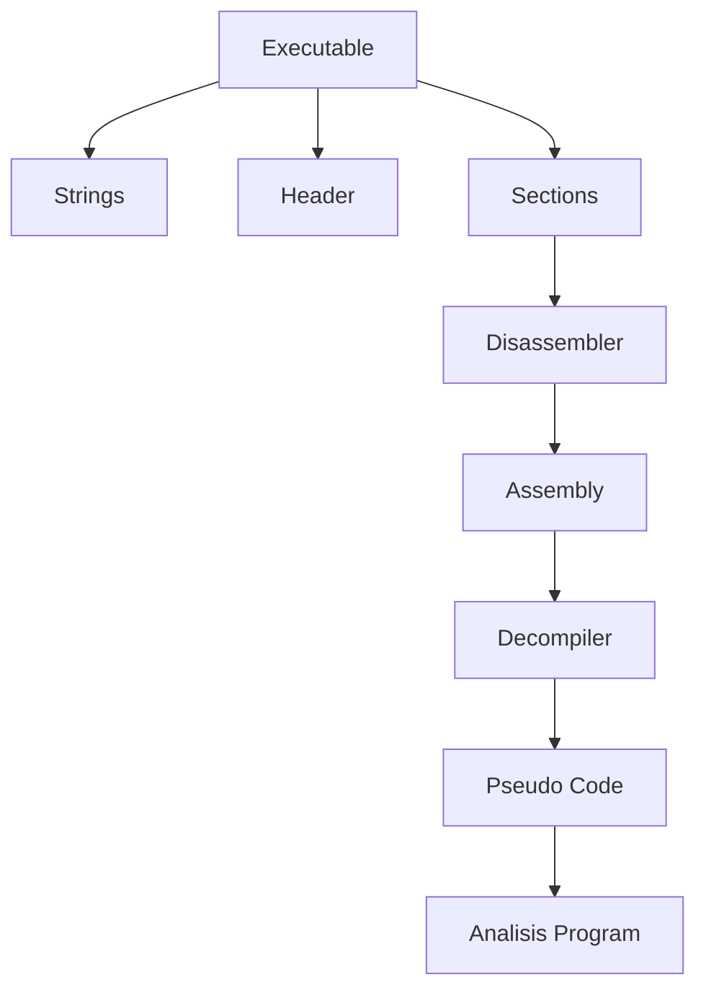

# Week 04 — Static Analysis dalam Reverse Engineering

---

# Ringkasan

Pada pertemuan keempat, saya mempelajari **Static Analysis**, yaitu teknik menganalisis sebuah program tanpa menjalankannya secara langsung. Metode ini bertujuan untuk memperoleh informasi mengenai struktur internal executable, fungsi-fungsi yang dimiliki, alur program, serta berbagai karakteristik lainnya hanya melalui proses pemeriksaan file. Selain itu, saya juga mempelajari penggunaan **Virtual Machine (VM)** sebagai lingkungan yang aman dalam proses Reverse Engineering sehingga analisis dapat dilakukan tanpa mengganggu sistem operasi utama, terutama ketika berhadapan dengan malware atau aplikasi yang belum diketahui tingkat keamanannya.

---

# Pembahasan Materi

## 1. Apa itu Static Analysis?

Static Analysis adalah proses menganalisis suatu executable tanpa menjalankannya. Seluruh informasi diperoleh melalui pemeriksaan struktur file, isi binary, metadata, maupun hasil disassembly.

Berbeda dengan Dynamic Analysis yang mengamati perilaku program saat dijalankan, Static Analysis lebih berfokus pada bagaimana program dibangun dan bagaimana logika program dapat dipahami dari isi executable.

Informasi yang biasanya diperoleh antara lain:

- Struktur executable
- Header file
- Section
- String
- Import dan Export Function
- Library yang digunakan
- Compiler atau packer
- Entry Point
- Alur program

Metode ini sering menjadi langkah awal sebelum melakukan analisis yang lebih mendalam.

---

## 2. Mengapa Static Analysis Penting?

Static Analysis memiliki beberapa keuntungan, antara lain:

- Tidak perlu menjalankan program sehingga relatif lebih aman.
- Dapat memperoleh banyak informasi awal mengenai executable.
- Membantu menentukan strategi analisis berikutnya.
- Mempercepat proses identifikasi file mencurigakan.
- Menjadi dasar sebelum melakukan Dynamic Analysis.

Dalam analisis malware, Static Analysis biasanya dilakukan terlebih dahulu untuk mengetahui karakteristik dasar malware sebelum dieksekusi di lingkungan yang aman.

---

## 3. Disassembler

Disassembler merupakan tools yang mengubah machine code menjadi bahasa Assembly sehingga lebih mudah dipahami oleh analis.

Contoh tools:

- IDA Free
- Ghidra
- Cutter
- Binary Ninja

Contoh sederhana:

```text
Machine Code

55 8B EC

↓

Assembly

push ebp
mov ebp, esp
```

Disassembler tidak mengembalikan source code asli, tetapi hanya menerjemahkan instruksi mesin menjadi Assembly.

---

## 4. Decompiler

Decompiler mencoba menerjemahkan machine code menjadi bahasa tingkat tinggi yang menyerupai C atau C++.

Contohnya:

Assembly

```asm
mov eax, 5
add eax, 3
```

Hasil decompile

```c
int x = 5;
x += 3;
```

Walaupun tampilannya menyerupai source code, hasil decompile bukanlah source code asli karena berbagai informasi seperti nama variabel dan komentar telah hilang selama proses kompilasi.

Decompiler membantu analis memahami logika program dengan lebih cepat dibanding membaca Assembly secara langsung.

---

## 5. Analisis Aliran Program (Program Flow)

Setelah memperoleh hasil disassembly, analis dapat mempelajari bagaimana program berjalan.

Beberapa hal yang diperhatikan antara lain:

- Function Call
- Conditional Jump
- Loop
- Percabangan
- Entry Point
- Return Address

Sebagian besar tools modern menyediakan tampilan **Graph View** sehingga hubungan antar fungsi dapat dipahami dengan lebih mudah.

Contoh sederhana:

```text
Start
  │
  ▼
Login
  │
 ┌┴─────────────┐
 │              │
 ▼              ▼
Valid        Invalid
 │              │
 ▼              ▼
Dashboard    Exit
```

Graph seperti ini sangat membantu ketika executable memiliki ratusan hingga ribuan fungsi.

---

## 6. Hex Editor

Selain disassembler dan decompiler, Reverse Engineer juga sering menggunakan **Hex Editor**.

Hex Editor digunakan untuk:

- Melihat isi file dalam bentuk hexadecimal.
- Memeriksa Magic Number.
- Mengidentifikasi struktur file.
- Melakukan patch sederhana.
- Membandingkan perubahan file.

Contoh tools:

- HxD
- Hex Fiend
- Bless

---

## 7. Virtual Machine dalam Reverse Engineering

Virtual Machine (VM) merupakan lingkungan virtual yang digunakan untuk menjalankan sistem operasi secara terisolasi dari komputer utama.

VM sangat penting dalam Reverse Engineering karena:

- Mengurangi risiko infeksi malware.
- Memungkinkan snapshot sebelum analisis.
- Mudah dikembalikan ke kondisi semula.
- Aman untuk pengujian executable yang belum dikenal.

Alur penggunaannya:

```text
Host Computer

↓

Virtual Machine

↓

Install Operating System

↓

Install Reverse Engineering Tools

↓

Lakukan Analisis
```

Beberapa software Virtual Machine yang umum digunakan:

- VMware Workstation
- Oracle VirtualBox
- Hyper-V

---

## 8. Workflow Static Analysis

Secara umum, tahapan Static Analysis dapat digambarkan sebagai berikut:

```text
Executable

↓

Hash Checking

↓

Detect File Format

↓

Strings Analysis

↓

Header Analysis

↓

Disassembly

↓

Decompiler

↓

Program Understanding
```

Workflow ini membantu analis memperoleh gambaran menyeluruh mengenai executable sebelum melanjutkan ke Dynamic Analysis.

---

# Perbandingan Tools

| Tools | Fungsi Utama |
|--------|--------------|
| IDA Free | Interactive Disassembler |
| Ghidra | Disassembler & Decompiler |
| HxD | Hex Editor |
| Detect It Easy (DIE) | Identifikasi compiler dan packer |
| PEStudio | Analisis executable Windows |
| Cutter | GUI untuk Radare2 |

---

# Diagram Static Analysis



---

# Insight Minggu Ini

Materi minggu ini membuat saya memahami bahwa banyak informasi penting mengenai sebuah program dapat diperoleh tanpa harus menjalankannya. Saya juga mulai menyadari bahwa Static Analysis merupakan tahap awal yang sangat penting dalam Reverse Engineering karena membantu analis memahami struktur executable, mengenali fungsi-fungsi penting, serta menentukan strategi analisis selanjutnya. Selain itu, penggunaan Virtual Machine menjadi langkah yang tidak boleh diabaikan agar proses analisis dapat dilakukan dengan aman dan tidak membahayakan sistem utama.

---

# Tools yang Dipelajari

- IDA Free
- Ghidra
- HxD
- Detect It Easy (DIE)
- PEStudio
- VMware Workstation
- Oracle VirtualBox

---

# Referensi

1. Modul Waskita Amikom Reverse Engineering
2. Ghidra Documentation
3. IDA Free Documentation
4. Microsoft PE Format Documentation
5. VMware Documentation
6. Oracle VirtualBox Documentation

---

# Refleksi Pembelajaran

## Apa yang Saya Pahami

Pada minggu ini saya memahami bahwa Static Analysis merupakan metode untuk menganalisis executable tanpa menjalankannya secara langsung. Saya mengetahui bahwa informasi penting seperti struktur file, header, strings, library, hingga alur program dapat diperoleh menggunakan berbagai tools seperti disassembler, decompiler, dan hex editor. Saya juga memahami bahwa penggunaan Virtual Machine merupakan bagian penting dalam Reverse Engineering karena menyediakan lingkungan analisis yang aman dan terisolasi.

## Apa yang Masih Membingungkan

Saya masih ingin mempelajari bagaimana tools seperti Ghidra atau IDA Free dapat mengenali fungsi-fungsi pada executable secara otomatis. Selain itu, saya juga ingin memahami bagaimana proses analisis dilakukan ketika executable telah diproteksi menggunakan teknik packing atau obfuscation sehingga hasil disassembly menjadi lebih sulit dibaca.

## Kesimpulan Pribadi

Materi mengenai Static Analysis memberikan pemahaman bahwa analisis executable tidak selalu harus dilakukan dengan menjalankan program. Dengan memanfaatkan berbagai tools Reverse Engineering, analis dapat memperoleh banyak informasi mengenai struktur dan logika program secara aman. Pengetahuan ini menjadi dasar yang penting sebelum mempelajari Dynamic Analysis pada pertemuan berikutnya.

---
