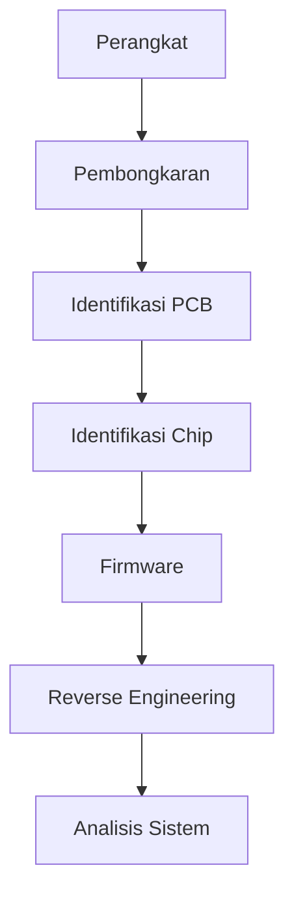

# Week 06 — Hardware Reverse Engineering

---

# Ringkasan

Pada pertemuan keenam, saya mempelajari konsep dasar **Hardware Reverse Engineering**, yaitu proses menganalisis perangkat keras untuk memahami cara kerja, struktur, serta mekanisme komunikasi yang digunakan. Berbeda dengan Reverse Engineering perangkat lunak yang berfokus pada executable, Hardware Reverse Engineering melibatkan analisis komponen fisik seperti PCB (Printed Circuit Board), firmware, hingga berbagai antarmuka komunikasi seperti UART, SPI, I²C, dan JTAG. Materi ini memberikan gambaran bahwa Reverse Engineering tidak hanya diterapkan pada software, tetapi juga pada perangkat embedded, IoT, maupun perangkat elektronik lainnya.

---

# Pembahasan Materi

## 1. Apa itu Hardware Reverse Engineering?

Hardware Reverse Engineering adalah proses mempelajari suatu perangkat keras tanpa memiliki dokumentasi teknis maupun desain aslinya. Tujuan utamanya adalah memahami bagaimana perangkat bekerja, bagaimana setiap komponen saling berinteraksi, serta mengidentifikasi potensi kelemahan keamanan yang mungkin ada.

Dalam praktiknya, proses ini sering dilakukan terhadap:

- Perangkat IoT (Internet of Things)
- Embedded System
- Router
- Smart TV
- Smartwatch
- Kamera CCTV
- Perangkat industri
- Perangkat jaringan

---

## 2. Tujuan Hardware Reverse Engineering

Hardware Reverse Engineering memiliki berbagai tujuan, di antaranya:

- Memahami desain perangkat.
- Menganalisis firmware.
- Mengidentifikasi celah keamanan.
- Memperbaiki perangkat yang sudah tidak didukung vendor.
- Mengembangkan kompatibilitas dengan perangkat lain.
- Melakukan penelitian keamanan pada sistem embedded.

Di bidang keamanan siber, Hardware Reverse Engineering sering digunakan untuk menguji keamanan perangkat IoT yang semakin banyak digunakan dalam kehidupan sehari-hari.

---

## 3. Komponen yang Dianalisis

Beberapa komponen utama yang biasanya dianalisis meliputi:

### PCB (Printed Circuit Board)

PCB merupakan papan tempat seluruh komponen elektronik terpasang.

Melalui PCB, analis dapat:

- Mengidentifikasi jalur komunikasi.
- Mengetahui jenis komponen.
- Melihat hubungan antar chip.
- Menentukan titik pengujian (*test point*).

---

### Chip

Chip merupakan komponen utama yang menjalankan fungsi tertentu.

Beberapa jenis chip yang umum ditemukan:

- Microcontroller (MCU)
- Microprocessor (MPU)
- EEPROM
- Flash Memory
- RAM
- Security Chip

Informasi pada chip biasanya digunakan untuk mencari dokumentasi atau datasheet yang membantu proses analisis.

---

## 4. Firmware

Firmware merupakan perangkat lunak tingkat rendah yang tersimpan di dalam memori perangkat keras dan bertugas mengendalikan fungsi dasar perangkat.

Firmware biasanya berisi:

- Bootloader
- Driver perangkat
- Sistem operasi embedded
- Konfigurasi perangkat
- Library

Firmware menjadi salah satu target utama dalam Hardware Reverse Engineering karena di dalamnya terdapat logika utama dari perangkat.

---

## 5. Antarmuka Komunikasi

Perangkat embedded umumnya memiliki antarmuka komunikasi yang dapat dimanfaatkan untuk analisis.

### UART (Universal Asynchronous Receiver Transmitter)

UART merupakan komunikasi serial sederhana yang sering digunakan sebagai media debugging.

Karakteristik:

- TX (Transmit)
- RX (Receive)
- GND

Melalui UART, analis sering memperoleh akses ke log boot maupun terminal sistem.

---

### SPI (Serial Peripheral Interface)

SPI digunakan untuk komunikasi berkecepatan tinggi antara mikrokontroler dan perangkat lain.

SPI memiliki empat jalur utama:

- MOSI
- MISO
- SCK
- CS

Antarmuka ini sering digunakan untuk membaca isi Flash Memory.

---

### I²C (Inter-Integrated Circuit)

I²C merupakan protokol komunikasi dua jalur yang banyak digunakan pada sensor maupun perangkat embedded.

Komponennya:

- SDA
- SCL

I²C memungkinkan beberapa perangkat berkomunikasi menggunakan satu jalur komunikasi yang sama.

---

### JTAG (Joint Test Action Group)

JTAG merupakan antarmuka debugging yang banyak digunakan pada proses pengembangan perangkat embedded.

Melalui JTAG, analis dapat:

- Membaca memori.
- Menjalankan debugging.
- Mengontrol CPU.
- Mengakses register perangkat.

Karena kemampuannya yang sangat luas, JTAG sering menjadi target utama dalam proses Hardware Reverse Engineering.

---

## 6. Tahapan Hardware Reverse Engineering

Secara umum proses Hardware Reverse Engineering dilakukan melalui beberapa tahap.

```text
Identifikasi Perangkat

↓

Membongkar Perangkat

↓

Identifikasi PCB dan Chip

↓

Mencari Datasheet

↓

Analisis Firmware

↓

Analisis Interface

↓

Memahami Cara Kerja Perangkat
```

Tahapan tersebut dapat berbeda tergantung jenis perangkat yang dianalisis.

---

## 7. Firmware Dumping

Salah satu proses penting adalah memperoleh firmware dari perangkat.

Beberapa metode yang dapat digunakan antara lain:

- Membaca Flash Memory.
- Menggunakan UART.
- Menggunakan JTAG.
- Menggunakan SPI Programmer.
- Mengunduh firmware resmi dari vendor.

Firmware yang berhasil diperoleh kemudian dapat dianalisis menggunakan tools Reverse Engineering seperti Ghidra atau IDA Free.

---

## 8. Tantangan dalam Hardware Reverse Engineering

Tidak semua perangkat mudah dianalisis.

Beberapa tantangan yang sering ditemui antara lain:

- Firmware terenkripsi.
- Chip menggunakan proteksi keamanan.
- Dokumentasi tidak tersedia.
- Jalur komunikasi disembunyikan.
- Komponen menggunakan teknologi khusus.

Oleh karena itu, Hardware Reverse Engineering sering membutuhkan kombinasi pengetahuan mengenai elektronika, sistem embedded, dan keamanan siber.

---

# Diagram Hardware Reverse Engineering



---

# Relevansi dalam Reverse Engineering

Hardware Reverse Engineering menjadi semakin penting seiring meningkatnya penggunaan perangkat IoT dan embedded system. Banyak perangkat modern menyimpan data sensitif serta terhubung ke internet sehingga berpotensi menjadi target serangan siber. Dengan memahami cara kerja perangkat keras dan firmware, analis keamanan dapat menemukan kelemahan sistem, mengembangkan solusi keamanan, maupun melakukan audit terhadap perangkat yang digunakan.

---

# Tools yang Dipelajari

| Tools | Fungsi |
|--------|--------|
| Ghidra | Analisis firmware |
| IDA Free | Disassembler firmware |
| Binwalk | Ekstraksi firmware |
| HxD | Hex Editor |
| FT232 USB to UART | Akses komunikasi serial |
| Logic Analyzer | Analisis sinyal digital |
| CH341A Programmer | Membaca Flash Memory |
| Multimeter | Identifikasi jalur dan komponen |

---

# Insight Minggu Ini

Materi minggu ini membuka wawasan saya bahwa Reverse Engineering tidak hanya dilakukan pada software, tetapi juga pada perangkat keras. Saya memahami bahwa firmware merupakan bagian penting dari perangkat embedded dan sering menjadi target analisis karena berisi logika utama sistem. Selain itu, saya juga mengetahui bahwa antarmuka seperti UART, SPI, dan JTAG memiliki peran penting dalam proses analisis maupun debugging perangkat.

---

# Referensi

1. Modul Waskita Amikom Reverse Engineering
2. Ghidra Documentation
3. Binwalk Documentation
4. JTAG Boundary Scan Standard
5. Embedded Systems Documentation

---

# Refleksi Pembelajaran

## Apa yang Saya Pahami

Pada minggu ini saya memahami bahwa Hardware Reverse Engineering merupakan proses untuk mempelajari cara kerja perangkat keras melalui analisis komponen fisik maupun firmware. Saya mengenal berbagai antarmuka komunikasi seperti UART, SPI, I²C, dan JTAG yang sering dimanfaatkan untuk mengakses maupun menganalisis perangkat embedded. Saya juga memahami bahwa firmware menjadi salah satu bagian terpenting karena berisi instruksi yang mengendalikan fungsi perangkat.

## Apa yang Masih Membingungkan

Saya masih ingin mempelajari proses ekstraksi firmware secara langsung menggunakan perangkat seperti SPI Programmer atau JTAG serta bagaimana cara menganalisis firmware yang telah berhasil diperoleh. Selain itu, saya juga ingin memahami teknik yang digunakan produsen untuk melindungi firmware agar tidak mudah diakses oleh pihak yang tidak berwenang.

## Kesimpulan Pribadi

Materi mengenai Hardware Reverse Engineering memberikan pemahaman bahwa analisis keamanan tidak hanya terbatas pada perangkat lunak, tetapi juga mencakup perangkat keras yang menjalankan sistem embedded. Dengan memahami struktur perangkat, firmware, serta antarmuka komunikasi yang digunakan, saya memiliki gambaran mengenai proses analisis perangkat secara menyeluruh. Pengetahuan ini menjadi bekal penting untuk memahami keamanan perangkat IoT dan embedded system pada perkembangan teknologi saat ini.

---
